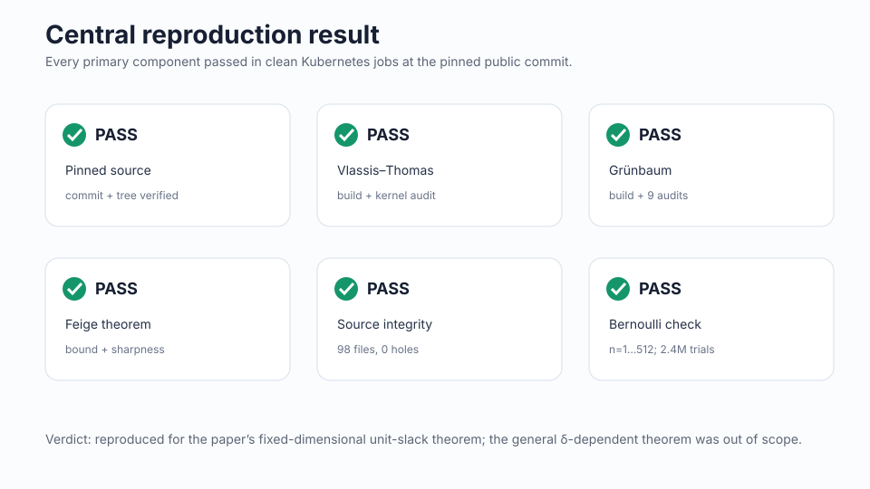
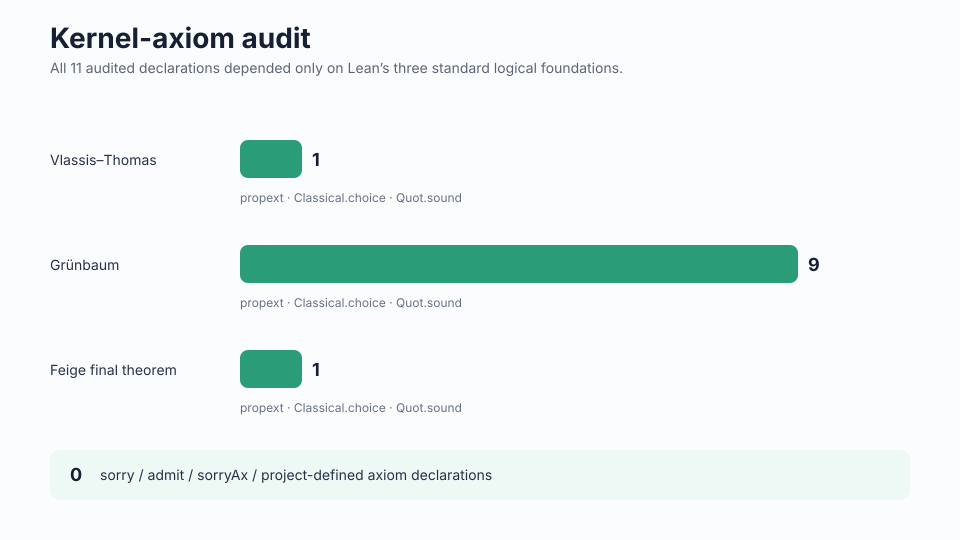
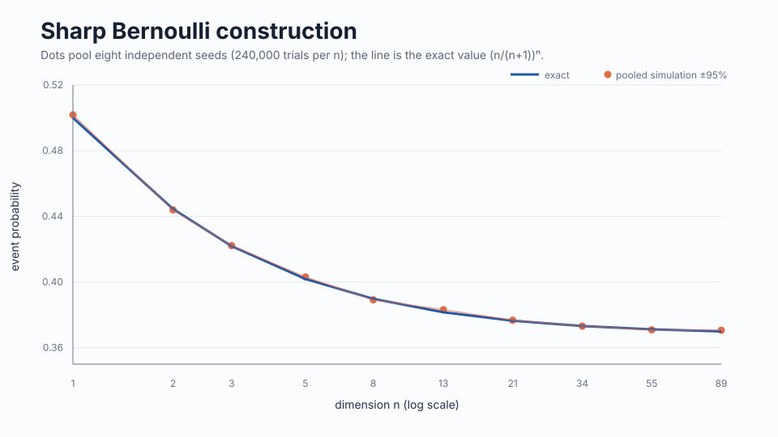
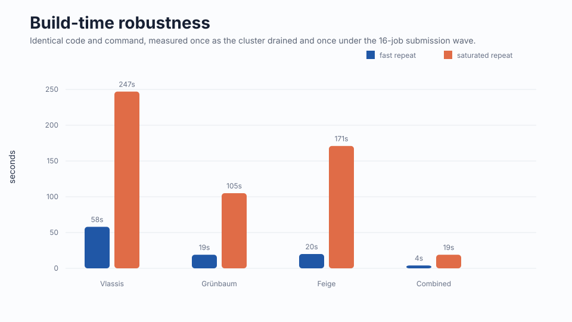
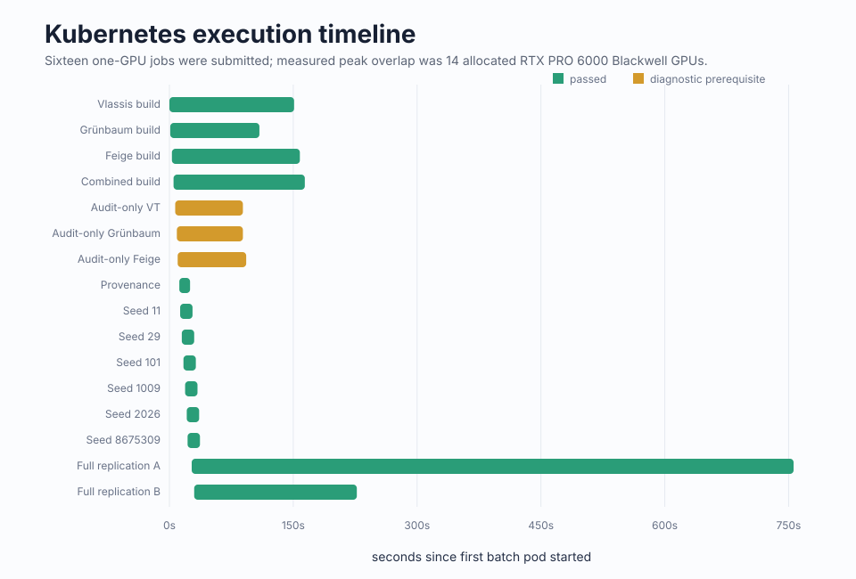

# Reproducing Feige’s sharp unit-slack bound

The paper asks how often a sum of independent, nonnegative random quantities must stay below its own mean plus one. Its key idea is to combine a probability-calibration result with a geometric statement about cutting a simplex, producing an exact finite-dimensional guarantee. This reproduction tested both the machine-checked proof chain and the construction showing that the guarantee cannot be improved.

## Verdict

**Reproduced** for the fixed-dimensional unit-slack claim. The scope is exactly \(\delta=1\): the broader \(\delta\)-dependent inequality was not tested.

Read each card as an independently checked link in the claim. The formal theorem and its sharpness proof compiled at the pinned public commit; the source and kernel audits found no unapproved proof mechanism; exact arithmetic and simulation agreed with the extremal probability.

The [Molab notebook](https://molab.marimo.io/github/alphaXiv/feige-231f2e0b/blob/main/notebooks/unit_slack_reproduction.py) is self-contained and opens with these results.

## What the claim says

For every positive finite \(n\), independent nonnegative variables \(X_1,\ldots,X_n\) with \(\mathbb E X_i\leq1\) satisfy

\[
\Pr\!\left[S<\mathbb E S+1\right]\geq\left(\frac n{n+1}\right)^n,\qquad S=\sum_iX_i.
\]

The Lean entry point `Feige.sharp_unit_slack_feige_complete` states both validity and fixed-dimensional optimality. The extremizer sets each \(X_i=n+1\) with probability \(1/(n+1)\), and zero otherwise. Then \(\mathbb E X_i=1\), and the strict event occurs exactly when every coordinate is zero, with probability \((n/(n+1))^n\).

## Formal proof evidence

Every job cloned `pengzhang91/Feige` at commit `98ab466e74280ae9d40622c19dc7f24f01b60864` and verified tree `4406b0e9177f06cf24be645e8c54637137f0ab3e`. Lean 4.31.0 and Mathlib commit `fabf563…` were resolved from the project lockfile. Clean builds succeeded separately for Vlassis–Thomas calibration, Grünbaum geometry, and the Feige assembly; `lake build` also succeeded with all default targets together.

All 11 published `#print axioms` checks reported only `propext`, `Classical.choice`, and `Quot.sound`. A scan of 98 Lean files found zero occurrences of `sorry`, `admit`, `sorryAx`, or project-defined `axiom` declarations. Three audit-only diagnostics confirmed that the audit files require their project target to be built first—the same ordering used by the authors’ CI.

| Claim | Paper result | Observed evidence | Assessment |
|---|---|---|---|
| Unit-slack lower bound | \((n/(n+1))^n\) for every \(n>0\) | Final theorem built twice; kernel audit clean | Aligned |
| Fixed-\(n\) sharpness | Bernoulli construction attains equality | Lean sharpness chain built; exact arithmetic for \(n=1\ldots512\) | Aligned |
| Hole-free formalization | No placeholders or nonstandard axioms | 0 forbidden tokens; 11 declarations use only standard foundations | Aligned |

## Independent sharpness check

Exact rational arithmetic recomputed the construction for all \(n=1,\ldots,512\). Eight seeds then simulated the coordinates directly at ten dimensions, using 30,000 trials per seed and dimension.

Across 2.4 million trials and 80 dimension–seed points, the mean absolute error was 0.00237. Seventy-seven of 80 pointwise 95% Wilson intervals contained the exact value, consistent with nominal coverage; the largest absolute standardized deviation was 2.56. This supports the probability identity but is secondary to the exact calculation and formal theorem.

## Compute and robustness

All evidence ran on the configured Kubernetes cluster using NVIDIA RTX PRO 6000 Blackwell GPUs. The jobs requested one GPU each although Lean compilation is CPU-bound; measured peak overlap was 14 GPUs. From the first Kubernetes job at 19:28:43Z to the final completion at 19:45:17Z, actual elapsed wall time was 994 seconds (0.276 hours).

The fast full replication took 184 harness seconds; the repeat under peak contention took 717 seconds. Both produced identical build and audit outcomes, so the timing spread is an efficiency effect rather than a proof instability.

The batch combined proof builds, provenance checks, and independent simulations. Short controls finished while the final saturated compilation continued; no useful work remained after both complete replications passed.

## Interpretation and limitations

This is strong evidence for the selected claims: the released theorem closes from its stated assumptions, the optimality construction is inside the checked chain, and an independent exact calculation reaches the same constant. A successful Lean build validates the encoded theorem and imported interfaces as checked by Lean’s kernel; it is not a separate handwritten re-proof of every imported Mathlib theorem. The formal statement uses positive finite dimensions and small-universe probability spaces, and this reproduction does not address the paper’s formula for arbitrary positive \(\delta\).

Key branches: [Vlassis–Thomas](https://github.com/alphaXiv/feige-231f2e0b/tree/orx/vlassis-thomas-isolated-build), [Grünbaum](https://github.com/alphaXiv/feige-231f2e0b/tree/orx/grunbaum-isolated-build), [Feige](https://github.com/alphaXiv/feige-231f2e0b/tree/orx/feige-isolated-build), [combined build](https://github.com/alphaXiv/feige-231f2e0b/tree/orx/combined-default-build), and [full replication](https://github.com/alphaXiv/feige-231f2e0b/tree/orx/full-proof-chain-replication-b).
